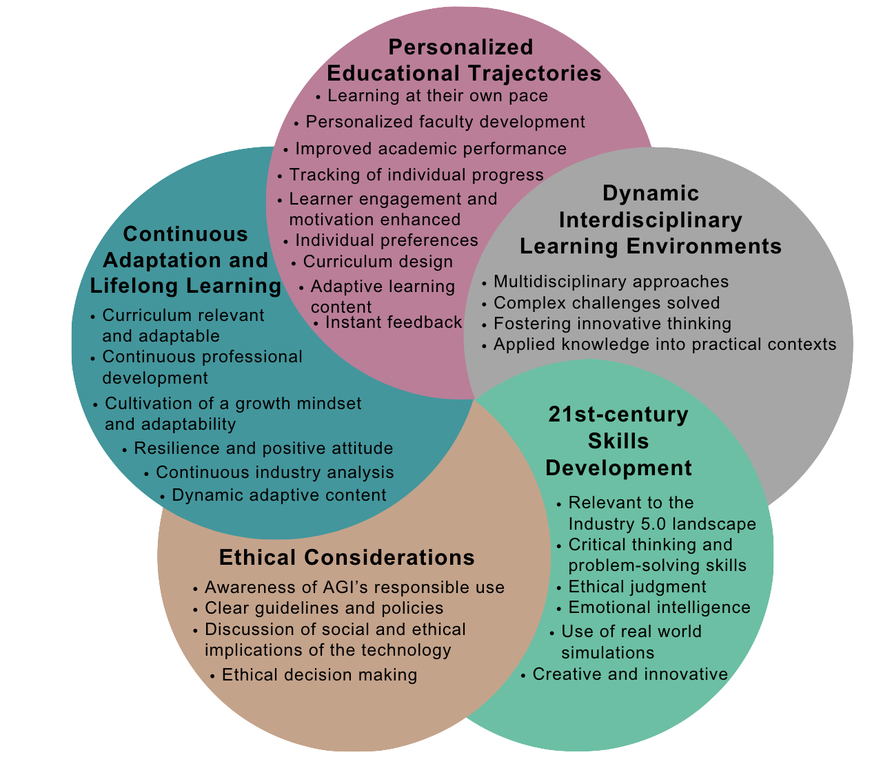

# A Framework for Integrating Artificial General Intelligence into Engineering Education: Enhancing Human-Centric Approaches for Industry 5.0

Este repositorio contiene el marco conceptual propuesto en el artículo **"A Framework for Integrating Artificial General Intelligence into Engineering Education: Enhancing Human-Centric Approaches for Industry 5.0"** por Trini S. Balart y Kristi J. Shryock.
